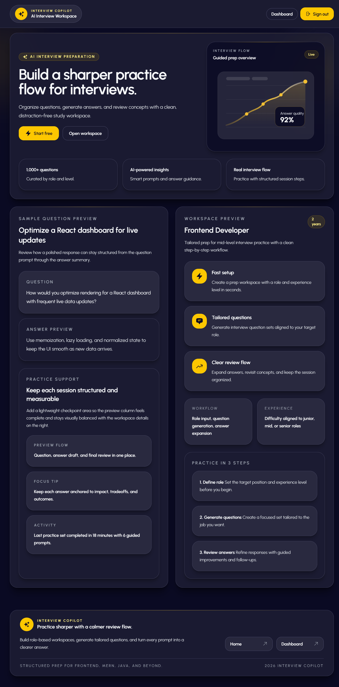
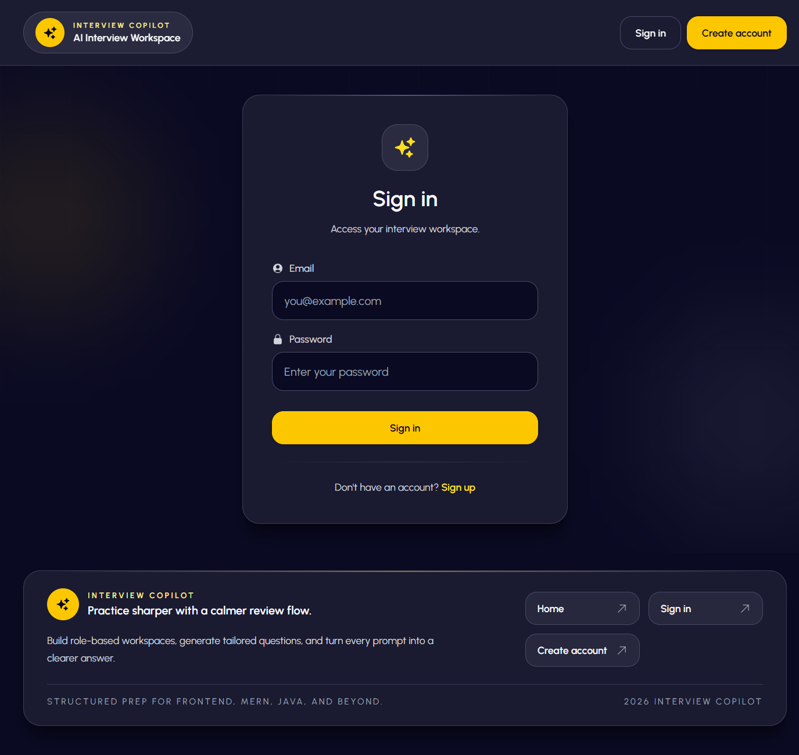
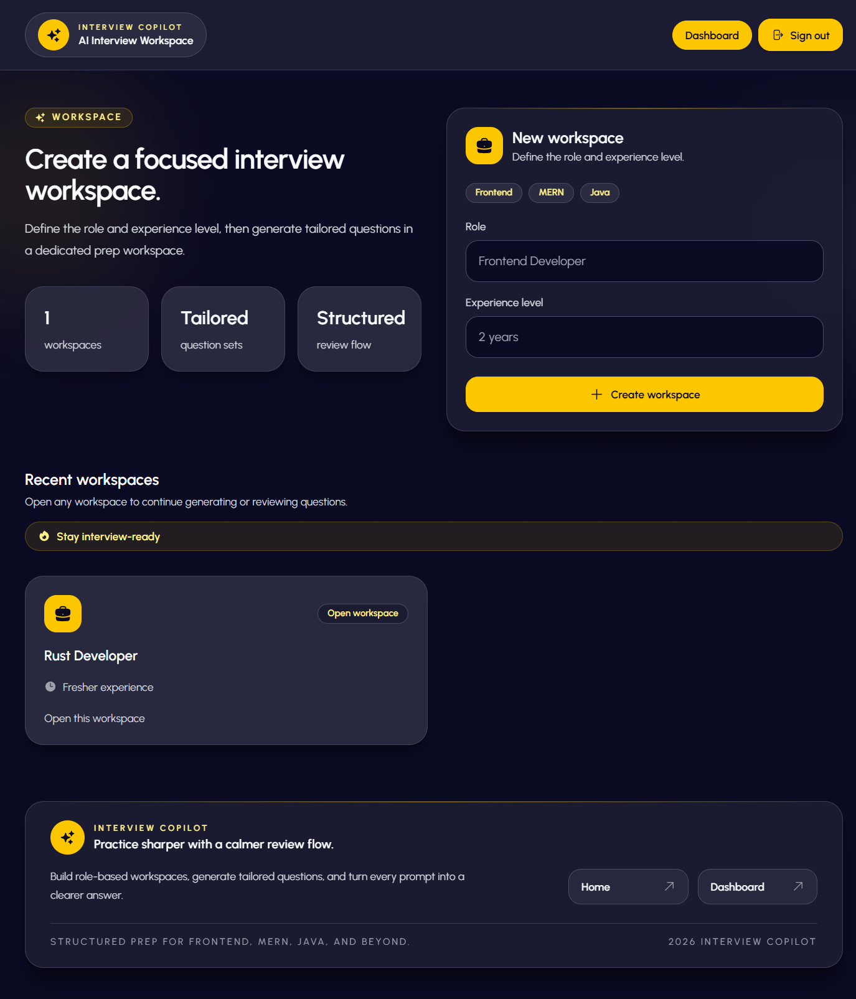
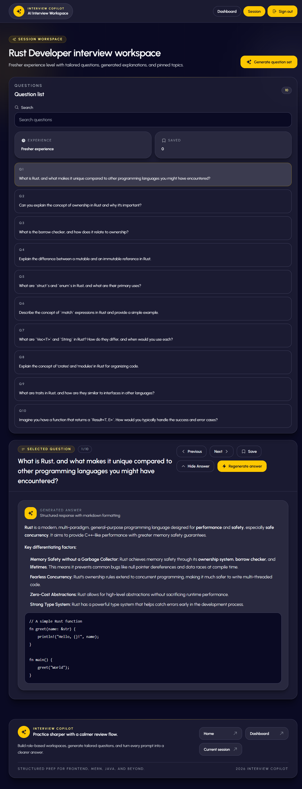

# Interview Copilot

A full-stack interview preparation app with a React frontend and an Express/MongoDB backend. Users can create role-based prep workspaces, generate tailored interview questions, and expand answers with Gemini-powered explanations.

## Project Structure

```text
backend/   Express API, MongoDB models, auth, Gemini integration
frontend/  React + Vite client application
```

## Tech Stack

- Frontend: React, Vite, Tailwind CSS, React Router
- Backend: Express, MongoDB, Mongoose, JWT auth
- AI: Google Gemini

## Screenshots

### Landing Page


### Sign In


### Dashboard


### Interview Session Workspace


## Getting Started

### 1. Install dependencies

```bash
cd backend
npm install
```

```bash
cd frontend
npm install
```

### 2. Configure environment variables

Create local env files from the included examples:

```bash
backend/.env.example   -> backend/.env
frontend/.env.example  -> frontend/.env
```

Backend env variables:

- `PORT`
- `MONGODB_URI`
- `JWT_SECRET`
- `GEMINI_API_KEY`

Frontend env variables:

- `VITE_API_BASE_URL`

### 3. Run the app

Backend:

```bash
cd backend
npm run dev
```

Frontend:

```bash
cd frontend
npm run dev
```

## Production Notes

- `npm start` in `backend/` runs the API with Node.
- `npm run build` in `frontend/` creates the production client build.
- Local-only files such as `.env`, `node_modules`, `dist`, and log files are gitignored.

## GitHub Readiness

This repo is prepared so you can safely publish the code without committing:

- secrets from local `.env` files
- installed dependencies
- generated frontend builds
- local log files

Before pushing, make sure your real credentials stay only in `backend/.env` and never in tracked files.
